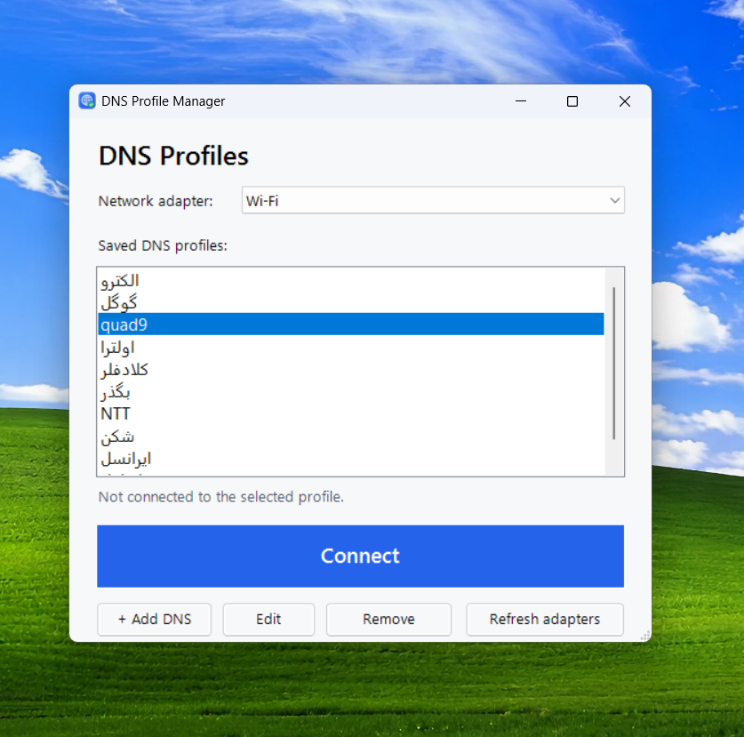

# DNS Profile Manager

A small Windows app for switching your DNS servers with one click. Save your favorite DNS pairs as profiles, pick a network adapter, and press **Connect** / **Disconnect**.

## Features

- Save any number of DNS profiles (name + primary + secondary IPv4 DNS)
- Add, **edit**, and remove profiles
- Choose which network adapter to change (defaults to Wi-Fi)
- One-click Connect / Disconnect (Disconnect resets the adapter to automatic DNS)
- Flushes the DNS cache after every change
- Installs like a normal app: Start menu + Desktop shortcut, listed in Settings > Apps

## Install

1. Go to the [Releases](../../releases) page and download `DnsProfileManager-Installer.zip`.
2. Extract the **whole** ZIP (don't run it from inside the ZIP).
3. Double-click `Install.bat` and accept the UAC prompt.

Uninstall from **Settings > Apps > Installed apps > DNS Profile Manager**.

> Windows SmartScreen may warn about the files because they are not code-signed. Click **More info > Run anyway**. The whole source is in this repository, so you can read exactly what it does.

## Requirements

- Windows 10 or 11
- Windows PowerShell 5.1 (built in)
- Administrator permission (needed to change DNS settings)

## How it works

The app is a PowerShell + Windows Forms script (`app/DnsProfileManager.ps1`). It uses the built-in `Get-DnsClientServerAddress` and `Set-DnsClientServerAddress` cmdlets. Profiles are stored in `%APPDATA%\DnsProfileManager\profiles.json`. Nothing runs in the background after you close the window, and the DNS setting you applied stays in Windows until you disconnect.

## Build a single Setup.exe (optional)

Install [Inno Setup](https://jrsoftware.org/isinfo.php) 6.3+, open `DnsProfileManager.iss`, and press **Compile**. The installer is created in `output/`.

## Run without installing

Right-click `app/DnsProfileManager.ps1` > **Run with PowerShell**.

## License

[MIT](LICENSE)
